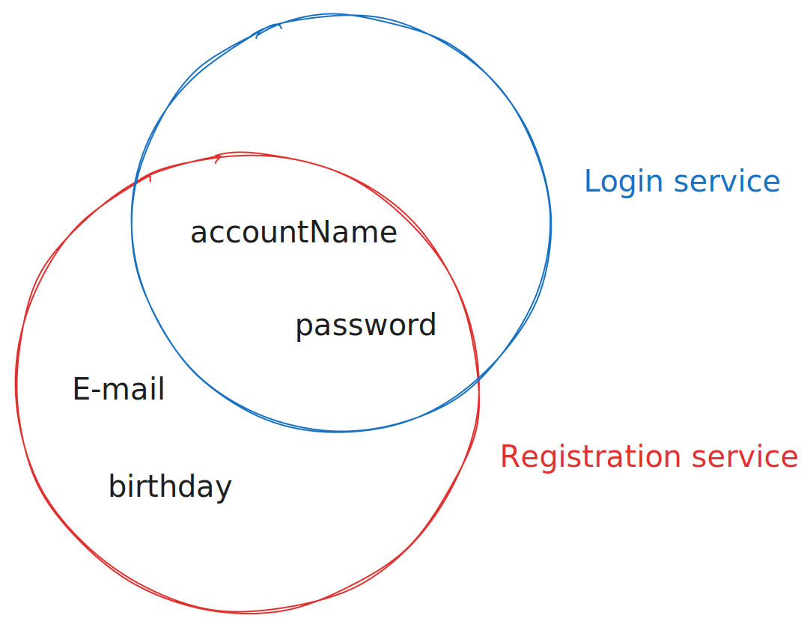

# Masterclass
In this document, you will learn the following:
1. The core values of the semantic.works stack and their benefits
2. How our design decisions reflect those values
3. What this resulted in

## Core values
### Keep It Simple Stupid
#### 1. Productivity through simplicity
1a. **Efficient development:** We wanted to get stuff done, without the requirement of being an expert on every topic, or creating a system that only the computer would understand
1b. **Clear overview:** Efficient development also comes in the form of overbloated applications, where you can easily lose track of what is handled where. We want to be able to look at a microservice and know immediately what it does.

#### 2. Functionality through interoperability
2a) **Maximize freedom:** There need to be rules: as few and liberating as possible. A lack of rules would cost interoperability, which would subsequently limit your freedom in the end.
2b) **Expandability:** We also wanted orthogonal features: features that would extened eachother at no extra cost.
2c) **Longevity:** Something built years ago should still work as expected.

### Not getting stuck
#### 3. 

## Design decisions
### Reuse everything
- Small but focused services allow reusing everything ([1a](#1-productivity-through-simplicity))

### Micro
- Small but focused services allow reusing everything ([1a](#1-productivity-through-simplicity))
- They are oftenly very easy to read, allowing a basic understanding even for those who do not know the language or framework in question
- Due to the small size of the services, debugging is easier: there are only a few hundred lines of code per service ([1a: efficient development & 1b: clear overview](#1-productivity-through-simplicity)).

### Standard API's
- Thanks to using technologies like JSON:API, services built years prior can still work as expected. ([2c: longevity](#2-functionality-through-interoperability))

### Centralised communication
The microservices never talk to eachother directly. Instead they use a **shared linked-data** database. This is complemented by microservices using a semantic model. ([2a: maximize freedom & 2b: expandability](#2-functionality-through-interoperability))

### Semantic models

Semantic models have a bunch of advantages:
- They can easily be appended upon ([2b: expandability](#2-functionality-through-interoperability))
- They allow re-using the same models: the same model can be used for username/password, OAuth, or even mock logins ([2a: Maximize freedom, 2b: Expandability](#2-functionality-through-interoperability))

## Implementations

### Simple Mental Model
#### Basic

#### In-depth

([micro](#micro))

- The **identifier** will create a session cookie. This doesn't identify you as a person (as this depends on what is in the database), but it gives a general hook ([centralised communication](#centralised-communication))
- The **dispatcher** will decide which **microservice** will be called for the made request
- Then the **triplestore** will change the requested state, yield a response of what has changed in the database, read the information you requested...

For example: this setup also means that the other services don't care what registration method was used, as they all work from the same [semantic models](#semantic-models) and database, yet care about different aspects of it.

### Limited base technologies
- **HTTP for communication:** If you build web application, you're probably already familiar with HTTP. ([Standard api's](#standard-apis))
- **JSON(:API) for sending data:** any programming language or framework that can read the widely known and used JSON will be able to be used. We then selected JSON:API to ensure consistency in our structure ([Standard api's](#standard-apis))
- **SPARQL for storing data:** SPARQL queries are also just strings: any technology that can manage JSON will be able to use SPARQL in one way or another. This way we can store all our data as linked data, whilst enjoying the compatibility of JSON.

### Docker & Docker-Compose
Docker allows for most technologies to be used on most systems. Docker-Compose are YAML files describing the topology of Docker containers and how they interact whith eachother, which gives us a place to define a central structure of our project. ([Micro](#micro), [Standard API's](#standard-apis))

### Categories
These categories structure our re-usable code.

#### Templates
These are a base for a custom built microservice with minimal overhead. From these you should be able to have a microservice going in your preferred language in minutes.

#### Services  
(Configurable) services built to not require (a lot) more coding to implement a (generic) feature. For example, `mu-cl-resources` is an easily configurable solution in case you need to "list" resources (e.g. a shopping cart, people in a database...). Frontends are hard to re-use as your customer will probably want a specific feel or implementation, but universal features can be re-used to fit the needs of multiple projects.

Services in the semantic.works stack should...
- Contain hareable/re-usable/runnable functionality (see the paragraph above)
- Require minimal configuration (sensible defaults are very okay)
- Persist its state in the database
- Be user facing (usually)

Services can be found through...
- Searching for the `mu-service` topic on GitHub
- Finding projects extending the templates (e.g. `mu-javascript-template`)
- Asking around

#### Ember add-ons
Like the configurable services, but for Ember.js frontend components and functionalities.

*This document has been adapted by Denperidge from Aad Versteden's masterclass 01 - How and why pt1, pt & pt3. You can view the original video [here]()*
